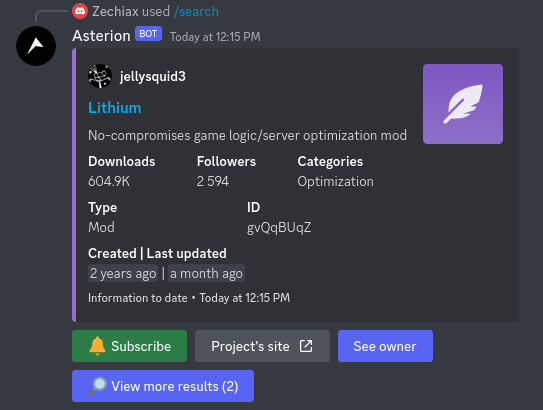
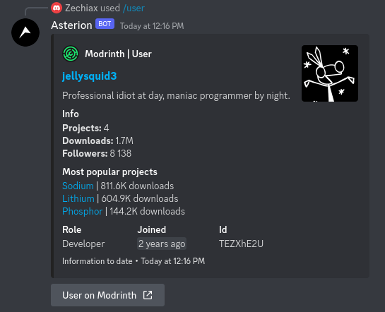
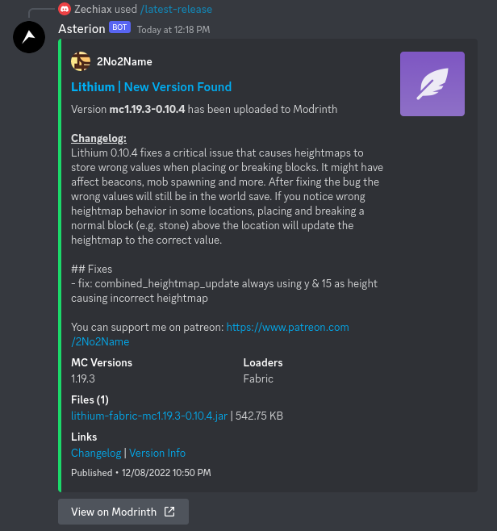

# Asterion

Access all of [Modrinth](https://modrinth.com/) within Discord

## Invite
- You can invite the bot by clicking [here](https://discord.com/api/oauth2/authorize?client_id=986993814671614094&permissions=537316416&scope=bot%20applications.commands)

## Features
- Search for Modrinth projects
- Find user on Modrinth
- Auto embed when message contains URL to a Modrinth project (opt-in feature)
- Subscribe for project updates and send them to custom channel

## Images

### Search

### User

### Latest release

## Wiki
On wiki there are guides and documentation for all commands: https://zechiax.gitbook.io/rinthbot/

## Bug reports / Feature suggestions
- If something's not working and the bot is online, check [Modrinth's status page](https://status.modrinth.com/) as Modrinth can be offline
- For bug reports and feature suggestions start a [new issue](https://github.com/Zechiax/RinthBot/issues/new)

## Data stored
- This bot needs to store some data so it can provide you with the updates
- Data stored are
    - Guild ID
    - Date the bot joined your guild
    - IDs of channels where you want to send updates
    - List of subscribed projects
        - And the date you subscribed to them
    - Bot preferences
- This data is stored in a database and is not shared with anyone else
- You can delete all data stored by the bot when you kick the bot from your guild
