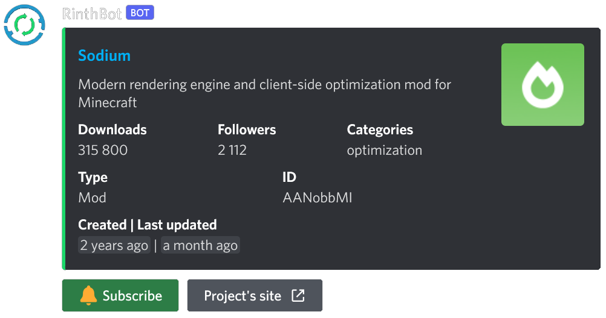

# RinthBot

-  Discord bot with which you can track project updates from the [Modrinth](https://modrinth.com/) platform 

## Images
### Search for projects:

## Invite
- You can invite the bot by clicking [here](https://discord.com/api/oauth2/authorize?client_id=986993814671614094&permissions=537316416&scope=bot%20applications.commands)

## Features
- Search for Modrinth projects
- Sends message when one of your subscribed projects got an update
- Easy subscribe with buttons from search
- Each project can send updates to different channel

## Wiki
On wiki there are guides and documentation for all commands: https://zechiax.gitbook.io/rinthbot/

## Bug reports / Feature suggestions
- If something's not working and the bot is online, check [Modrinth's status page](https://status.modrinth.com/) as Modrinth can be offline
- For bug reports and feature suggestions start a [new issue](https://github.com/Zechiax/RinthBot/issues/new)

## Data stored
- This bot needs to store some data so it can provide you with the updates
- Data stored are
    - Guild ID
    - IDs of channels where you want to send updates
    - List of subscribed projects
    - Additional settings
